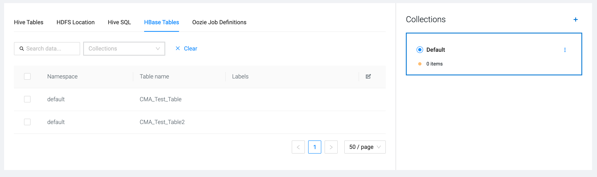
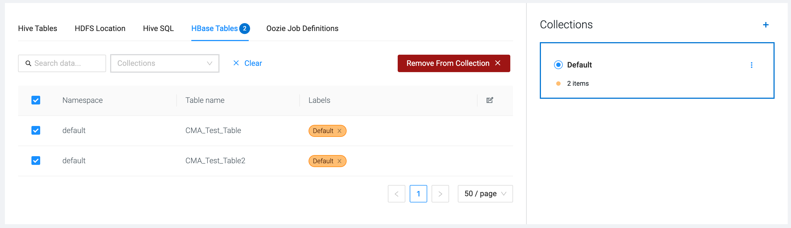
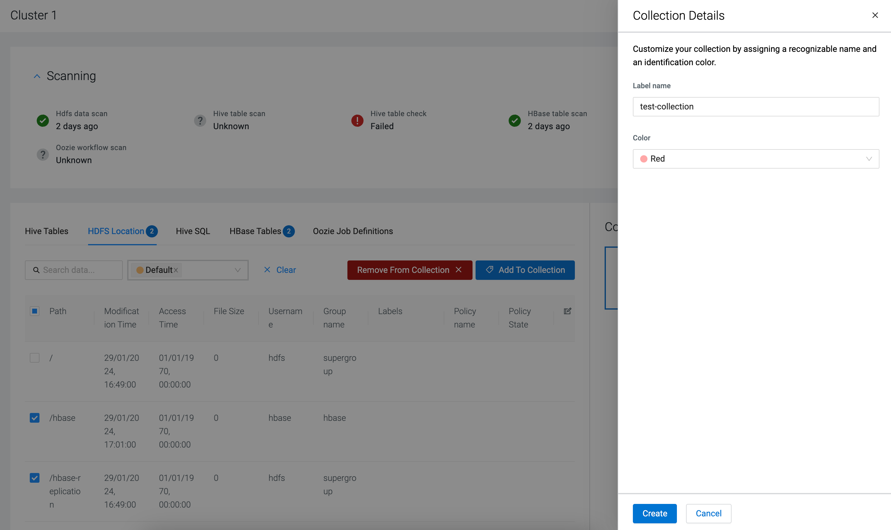
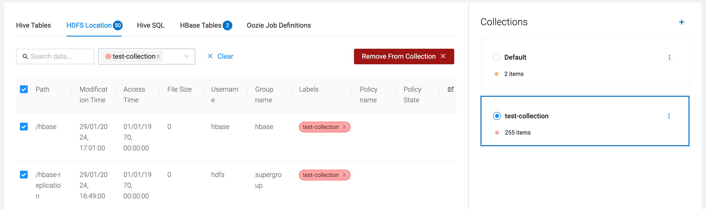

# Creating collections for migration

After scanning the source cluster, you can use collections to sort the datasets that need to be migrated to the target cluster. Collections can also be useful to organize different types of data and workflows before migration.

**Steps**

1. Click **Hive Tables**, **HDFS Location**, **Hive SQL**, **HBase Tables** or **Oozie Job Definitions** tab based on which items you would like to add to a collection.
The different tabs contain the results of the scanning. For example, the HBase Tables display all the existing tables in HBase on the source cluster.

2. Select the items that you want to add to a collection, and click **Add to collection**.
The selected items are added to the Default collection, and the **Default label** is assigned to the selected items.

You have the option to create more collections beside the Default collection.

3. Click the **hamburger** icon next to **Collections**, and customize the collection by providing a **Label name** and selecting a **Color**. Click **Create**.

Select more items from the scanning results, and add it to the newly created collection.

You can manage the created collections by clicking on the **hamburger** icon to open the collections menu. You can review the labeled results in a collection using **View Items**, and modify or delete the created collection using **Edit** and **Remove**. Removing a collection does not affect the items on the source cluster, only the labeling is deleted.

4. When the **Oozie Job Definitions** is selected, you can run **Hive3Parser** to select the job definitions with related Hive scripts.

**Result**

The datasets are labeled for migration.

**After you finish**

Register the target cluster to which the datasets and workflows are going to be migrated.