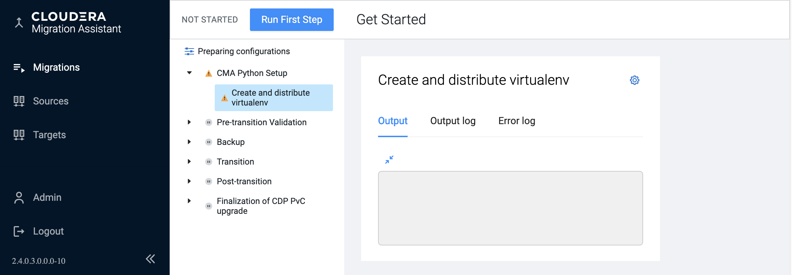
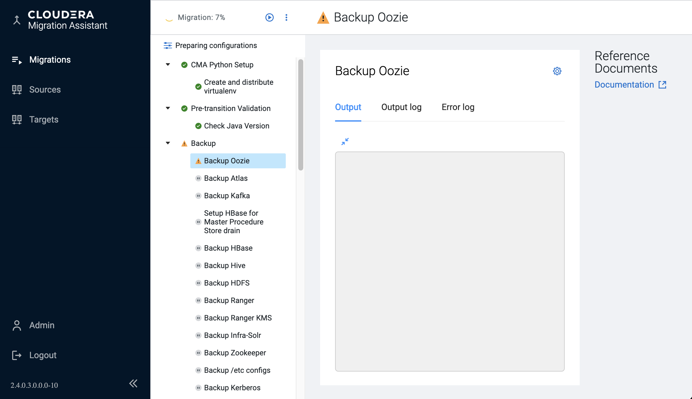
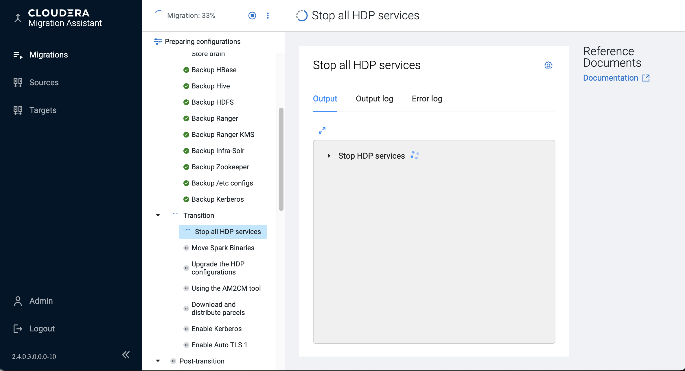
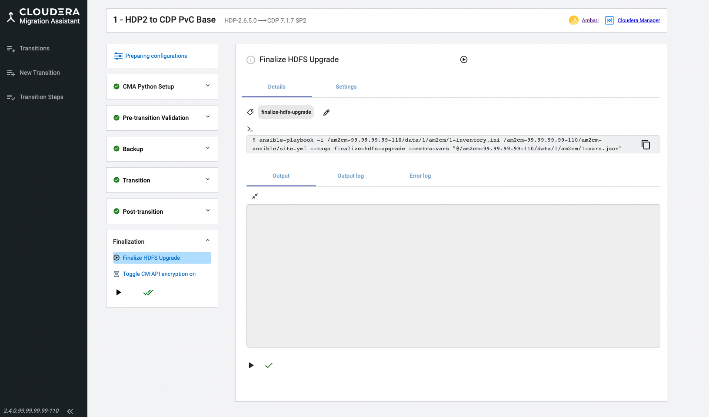
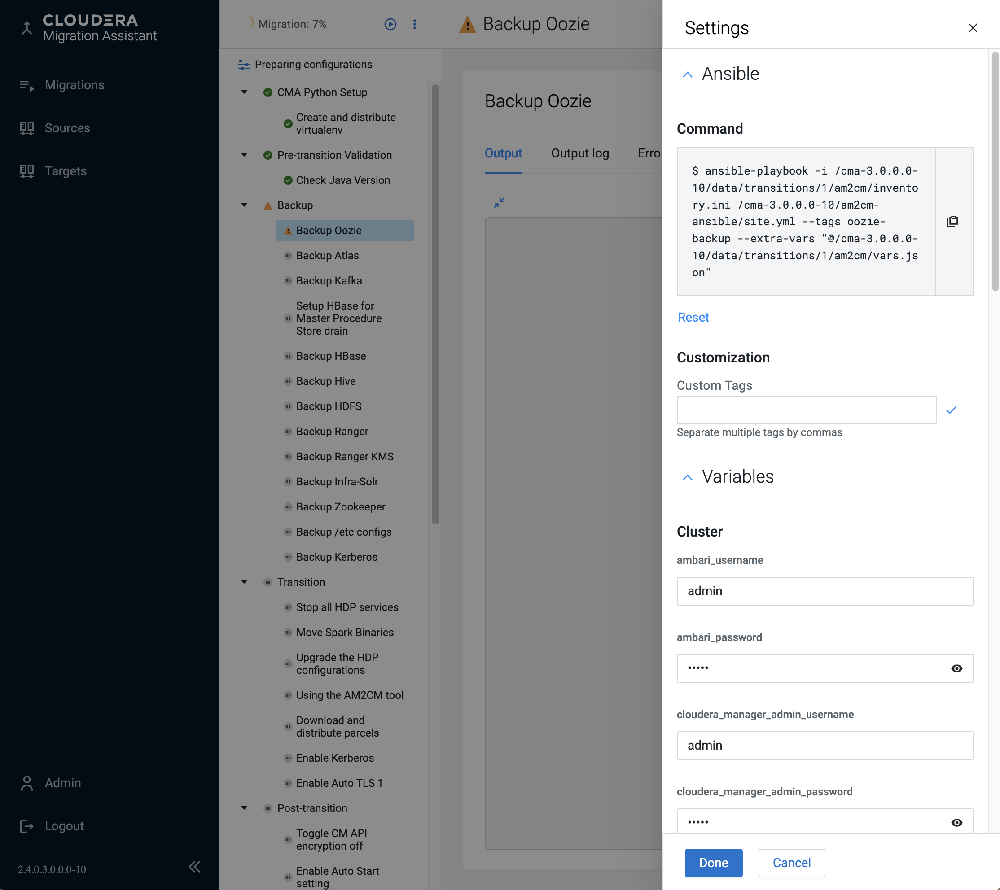

# HDP to CDP Private Cloud Base Execution Steps

## Transition Step Groups

Going inside our transition tile you can see the transition  steps on the left-hand side  that are waiting to be  executed.

These steps are grouped by their effect on the production cluster.  

Ansible scripts are triggered on the control node but most tasks are also executed on 
the cluster nodes. As a consequence, CMA requires Python and some packages 
(see _<CMA_ROOT_DIR>/am2cm-ansible/requirements.txt_) 
on all nodes to work properly.  
__CMA Python Setup__ creates temporary Python 3.9.8 virtual environments on all nodes, 
unless there is already a higher version installed. While the cluster nodes can be 
air-gapped the control node needs to access the Internet.

The second group is the __Pre-transition Validations__. 
Similarly to the Python environment setup these steps do not disturb the live cluster
and can be run any-time. This is to make sure that your cluster is ready to be upgraded.

The current version of CMA is still missing a lot of pre-check, 
therefore it is highly advised to check the 
__Cluster environment readiness__ documentation : 
- [HDP2](https://docs.cloudera.com/cdp-private-cloud-upgrade/latest/upgrade-hdp/topics/amb-cluster-environment-readiness.html)
- [HDP3](https://docs.cloudera.com/cdp-private-cloud-upgrade/latest/upgrade-hdp3-one-stage/topics/amb3-cluster-environment-readiness-one-stage.html)

The __Backup__ steps require our cluster to be in maintenance mode although it does not change payload data.
Please be aware that you might have additional (non-HDP) services and application that need additional backup implementation.
You might also add you own custom backup steps extending the
_cma-server/resources/transitions/am2cm/sections/hdpX-backup.yml_

The next two groups are more invasive and need a freshly installed empty Cloudera Manager
with Cloudera Management Service that is compatible with the intended CDP runtime version. 
See [Cloudera Manager Installation and Setup](https://docs.cloudera.com/cdp-private-cloud-upgrade/latest/upgrade-hdp3-one-stage/topics/amb3-one-stage-cm-installation-setup.html) 
and [Installing Cloudera Management Service](https://docs.cloudera.com/cdp-private-cloud-upgrade/latest/upgrade-hdp3-one-stage/topics/amb3-one-stage-cm-service.html) for details.
In __Transition__ we mostly change the binaries and update configs,
while in __Post-transition__ mostly the payload data structure is changed so that it is going to be compatible with the new service versions.

If you have a private parcel repository location you can change at the *Setting* icon of step __Download and distribute parcels__ at the Parcel Repo field.

> Note\
> From  CDP 7.1.9 on, Queue Manager can only have Postgres as an internal DB (instead of H2).
> By default CMA installs a new  Postgres DB instance, however you can specify an already
> existing DB here in Settings tab of the __Queue Manager__ Step

Before starting the __Finalization__ group you already have a fully fledged CDP cluster which is ready to be acceptance tested.
The significance of the  finalization is that once we execute it we  can not  roll back anymore, therfore
be careful about this. __After finalization there in no way to roll back.__

## Individual transition steps

All individual steps have the same structure. Each can be completed manually in the  old way of following documentation 
that is linked to the information icon, and then marked as done. However, the preferred approach is to press play that 
invokes the Ansible script.  Here you can see that all the UI does is calling these scripts one by one, based on their tags.

If you click the Settings icon (cogs), you will be able see the exact asnible command that is run, and you can also  some of the input parameters for these scripts.

If that’s not enough these scripts are shipped with CMA and can be tailored.  See folder _<CMA_ROOT_DIR>/am2cm_ansible_
Even the whole migration flow can be rearranged and tailored as they are described in a .yml file. See folder 
_<CMA_ROOT_DIR>/cma-server/config/transitions/am2cm_

For every transition step there is a tag displayed.  
You can use the tag to identify the ansible task being executed. 
The actual Ansible commands are called on control node where the CMA server 
(cma-server) is located and is shown below the tag. 
After you click the icon, output and error log tabs appear below the ansible command, 
allowing you to check the output logs associated with the ansible upgrade playbook.

These scripts manually executable on the am2cm-ansible directly on the control node (container)
and also encouraged to be modified when needed.  

