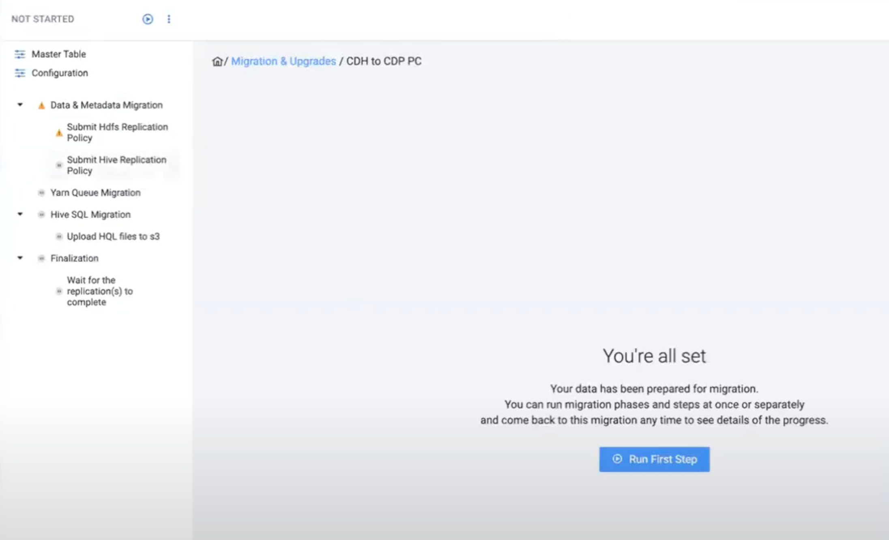

# Migrating from source cluster to target cluster

After registering the source and target cluster, and labeling the scanned datasets and workloads on the source cluster, you can start the migration process.

Because migrating data to S3 can take a long time, you can perform multiple migrations between a source and target cluster to move the data in stages. You can also choose to migrate only part of your data as opposed to all of it. A single CMA server is designed to handle multiple migrations.

**Steps**

1. Click **Migrations** on the left navigation pane.
2. Click **Start Your First Migration**.
3. Select **Cloudera Distributed Hadoop 5** or **Cloudera Distributed Hadoop 6** as **Source Type**.

The registered source cluster is selected by default. You can select any other cluster using the drop-down menu . In case you have not registered a source cluster at this point, click **New Source** and complete the steps in [Registering the source cluster](cma-new-source.md).

4. Click **Next**.

CDP Public Cloud and the registered target cluster are selected by default. You can select any other cluster using the drop-down menu. In case you have not registered a source cluster at this point, click **New Target** and complete the steps in [Registering the target cluster](cma-new-target.md).

5. Click **Next**.
6. Click **Next** to confirm the migration path.
7. Select one or more labels to migrate the datasets that were labelled to the target cluster.

You can select if the migration should **Run Now** or be completed in a **Scheduled Run**. **Run Now** means that all of the datasets and workloads that were selected with the labels are going to be migrated as soon as the process starts. When choosing the **Scheduled Run**, you can select the start date of the migration, and set a frequency in which the migration process should proceed.

8. Enable **YARN migration** if required, and provide the **Knox Token** to access Cloudera Manager of the Data Hub cluster in CDP Public Cloud. You also must set the **S3 Bucket Base Path for HDFS** when migrating HDFS data.
The remaining settings on the **Configurations** page are automatically filled out, but can be changed based on your requirements.

9. Click **Next**.
10. Review the information on the **Overview** page and ensure that the information is correct.

At this point, you can go back and change any configuration if the information is not correct.

11. Click **Create** to save the migration plan. You can follow the progress of creating the migration plan.

12. Click **Go to Migrations**, and select the created **CDH to CDP PC** migration.
13. Click **Run First Step** to start the migration.

You can see the status and steps of the migration process.
The **Master Table** shows a read-only version of the label and the related datasets, and the **Configuration** details the migration configurations.

The **Data & Metadata Migration** executes the data migration of the labeled datasets with Replication Manager.

You can also view the migration process of the data and workloads based on the selected services. For example, the **Hive SQL Migration** replicates the Hive SQL queries that were fixed to be Hive complied during the Hive Workload migraton steps.

The **Finalization** waits until all the Replication Manager policies complete their jobs. If the label is created as a frequently scheduled migration, the Replication Manager waits only for the first jobs.

**Result**

The datasets and workloads selected are migrated from CDH to CDP Public Cloud.