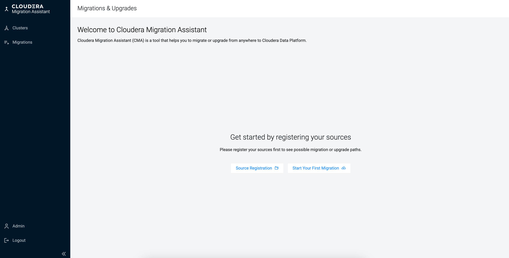
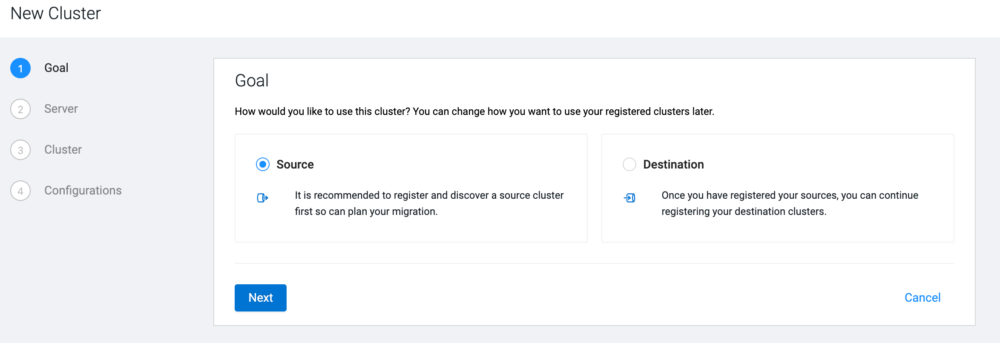
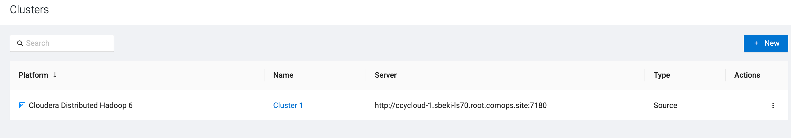

# Registering source clusters
To migrate from CDH to CDP Public Cloud, you need to register the CDH cluster as a source from which the data, metadata and workload will be migrated.

**Before you begin**
- Make a note of the following information about the CDH cluster to complete the source registration:
    - Cloudera Manager URL
    - Admin username and password for Cloudera Manager
    - SSH user, port, and private key

**Steps**
1. Click **Source Registration** on the homepage of Migration Assistant to register a cluster that will be used as a source for the migration.

2. Select **Sourc**e as your cluster type, and click **Next**.

Alternatively, you can open the **New Cluster** wizard by selecting **Clusters** on the left navigation pane, and clicking **New**.

3. Select **Cloudera Distributed Hadoop 5** or **Cloudera Distributed Hadoop 6** as **Source Type**.
4. Provide the URL of Cloudera Manager that belongs to the CDH 5 or CDH 6 cluster.
The URL needs to be in the following format:
`https://[***CLOUDERA MANAGER HOSTNAME***]:[***CLOUDERA MANAGER PORT***]/`
5. Provide the **Admin user** and **Admin password** of Cloudera Manager.
6. Click **Next**.
7. Choose the cluster based on the **Cluster Name** that you want to use for the migration.
The drop-down list contains all of the clusters that are managed by Cloudera Manager on the provided host.
8. Click **Next**.
9. Select the **Configuration Preference** based on which authentication method you prefer.
    - Choose **Use existing** if you want to use the  SSH configuration and keys of the user running CMA server  to access the hosts.
    - Choose **New** if you want to use a newly provided SSH key to configure Ansible automatically.
        - Provide the **SSH User** and **SSH Port**.
        - Copy the **SSH Key** to the SSH Key box or upload a `.pem` file containing the key.
10. Click **Create**.

**Result**

The registered CDH cluster is listed on the Sources page.

**After you finish**

Scan the data and workloads on the registered source cluster and add labels to specify the objects, which should be included in the migration.