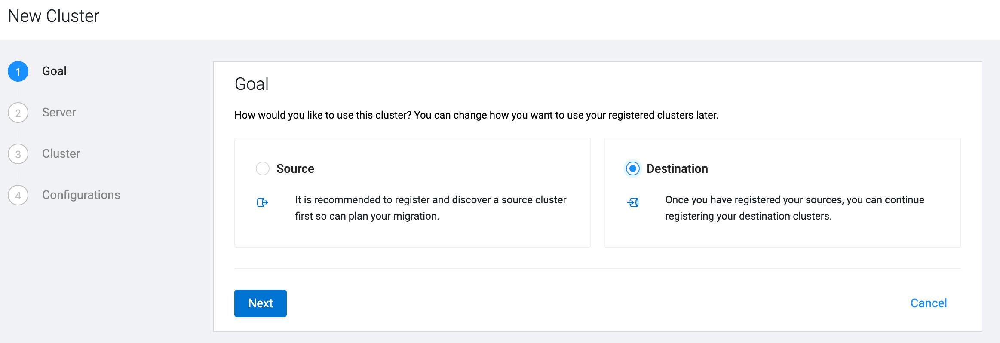
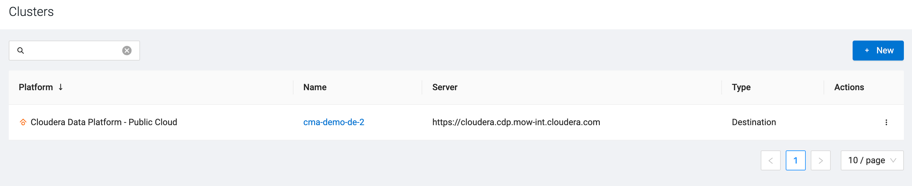

# Registering target clusters

As you are migrating from CDH to CDP Public Cloud, you need to register the Public Cloud cluster as a target to which the data, metadata, and workload will be migrated.

**Before you begin**

Note down the following information about the Public Cloud cluster to complete the target registration:
- Access key and private key
For more information about how to generate access and private key, see the [Generating an API access key](https://docs.cloudera.com/management-console/cloud/user-management/topics/mc-cli-generating-an-api-access-key.html) documentation.
- SSH user, port, and private key

**Steps**
1. Click **Clusters** on the left navigation pane.
2. Click **Destination** as your cluster type, and click **Next**.

3. Select **CDP Public Cloud** as **Target Type**.
4. Select the **Control Plane URL** where the cluster is located.
5. Provide the **Access Key** and **Private Key** of your CDP user account.
6. Click **Next**.
7. Choose the cluster based on the **Cluster Name** that you want to use for the migration.
The drop-down list contains all of the existing clusters of CDP Public Cloud that you have access to.
8. Click **Next**.
9. Select the **Configuration Preference** based on which authentication method you prefer.
    - Choose **Use existing** if you want to use the  SSH configuration and keys of the user running CMA server  to access the hosts.
    - Choose **New** if you want to use a newly provided SSH key to configure Ansible automatically.
        - Provide the **SSH User** and **SSH Port**.
        - Copy the **SSH Key** to the SSH Key box or upload a `.pem` file containing the key.
10. Provide the **S3 Bucket Access Key** and **S3 Bucket Secret Key**.
11. Click **Create**.

**Result**

The registered Public Cloud cluster is listed on the Targets page.

**After you finish**

Start the migration from CDH to CDP Public Cloud.