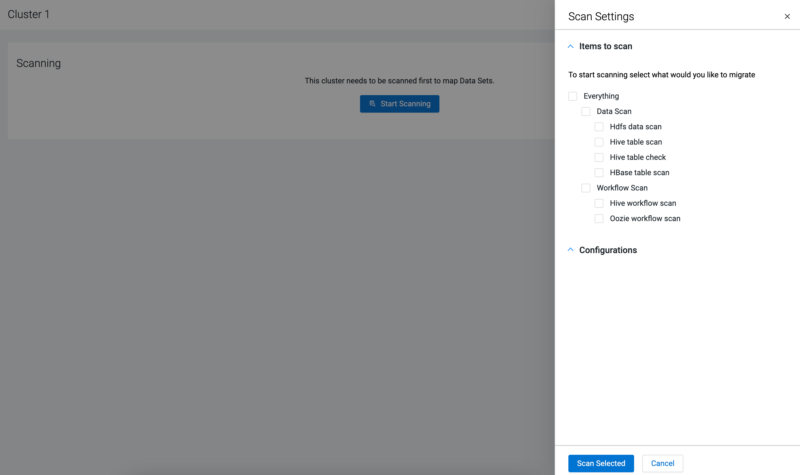
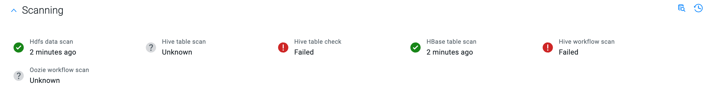
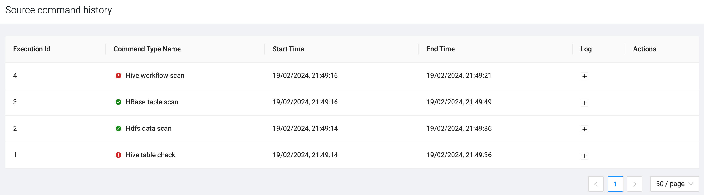
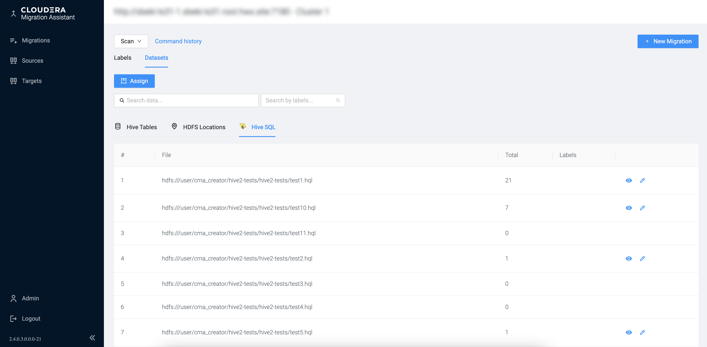
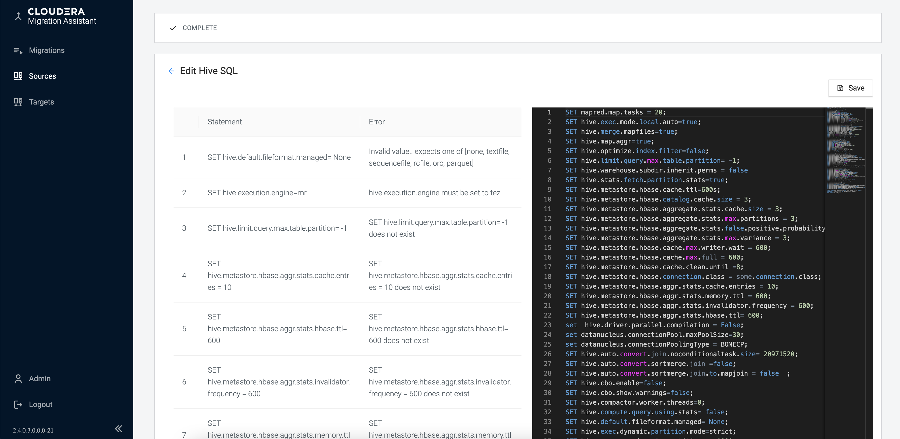
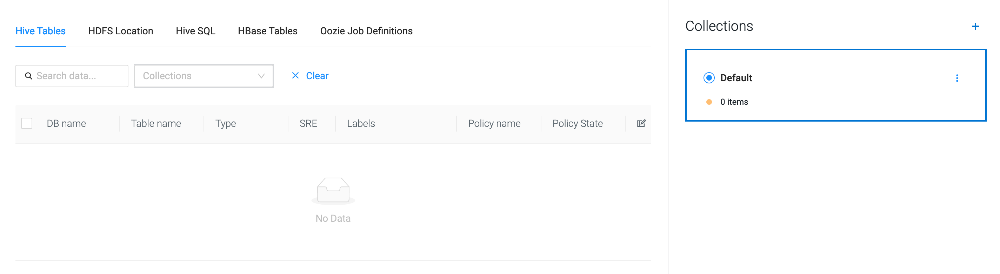

# Scanning the source cluster

You need to scan the CDH source cluster to identify the available datasets and workloads that can be migrated. Scanning also enables you to review and resolve syntax errors that can occur after the migration.

**Steps**

1. Click on the CDH cluster you want to use for the migration on the **Clusters** page.
2. Click **Start Scanning** to open the Scan Settings where you can select the data and workloads for scanning.

3. Select **Everything** or choose from the different scanning options.

The following items are available for scanning:

- **HDFS data scan:** The HDFS data scan uses `_hdfs_report_` module from the [CDH Discovery Tool](https://github.com/cloudera-labs/toolkits/blob/main/upgrade-toolkit/CDH-Discovery-Tool/README.md) to scan HDFS on the source cluster.
- **Hive table scan:** The Hive table scan uses `_hive_metastore_` module from the [CDH Discovery Tool](https://github.com/cloudera-labs/toolkits/blob/main/upgrade-toolkit/CDH-Discovery-Tool/README.md) to scan Hive on the source cluster.
- **Hive table check:** Scanning Hive tables on the source cluster. `_Hive Table Check_` embeds `sre` and `u3` sub-programs of the [Hive SRE Tooling](https://github.com/cloudera-labs/hive-sre). The result will be visible at the SRE column of the Hive datasets.
- **HBase table scan:** Scanning HBase tables on the source cluster.
- **Hive Workflow scan:** Scanning Hive SQL queries on the source cluster. You can pre-scan Hive2 SQL queries against Hive3 with the Hive Workflow scan option. When selecting this Hive Workflow option, you need to provide the location of your queries as shown in the following example:
    - HDFS paths
      - With default namespace: `hdfs:///dir/`, `hdfs:///dir/file`
      - With specified namespace: `hdfs://namespace1/dir`, `hdfs://namespace1/dir/file`
      - With namenode address: `hdfs://nameNodeHost:port:/dir`, `hdfs://nameNodeHost:port:/dir/file`
    - Native file paths: `your/local/dir`, `nodeFQDN:/your/local/dir/sqlFile`
- **Oozie workflow scan:** Scanning Oozie workflows on the source cluster. When selecting Oozie workflow scan, you need to provide the **Number of latest days** to scan.
4. Click **Scan selected**.
You will be redirected to the scanning progress where you can monitor if the selected items are successfully scanned or encountered an error.

  - Click  to open the **Scan Setting**s again to add more items to the scan or trigger a rescan of the already scanned items.
  - Click  icon to open the **Source command history** to have more insight about the scanning progress, stop an in progress scan and review the log.

  

> Note: The scan results are also available at the data directory of the source cluster, which is located in the `/<CMA_ROOT_DIR>/data/sources/ClusterName/Source_ID/cluster-scan/` folder on the CMA server node.

When reviewing **Hive SQL**, you can check and edit any SQL query related errors before migrating the workflows to Public Cloud. The migration will be successful regardless of fixing the statement errors. However, you will not be able to execute the SQL queries on the new cluster due to the compatibility issues between Hive2 and Hive3.

You can review the list of errors using **View**, and open the editor using **Edit**.

After fixing the statement errors in the SQL editor window, **Save** the changes. The edited queries are replicated and saved in the S3 bucket of the target cluster. The original files are not overwritten.

5. After the scanning is completed, you can add the tables and workflows from the selected services to collections. **Collections** serve as an organizational method to sort out the data and workflows resulted from the scan for migration.

**Result**

The datasets and workflow on the CDH source cluster is scanned for Hive, HDFS, HBase and Oozie.

**After you finish**

Sort the scanned data and workflows into collections to have more control over what is migrated from the source cluster to the target cluster.

