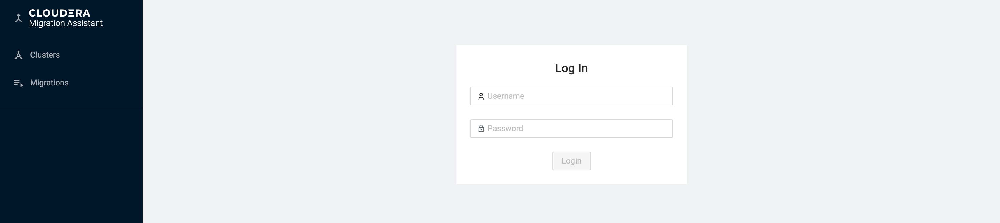
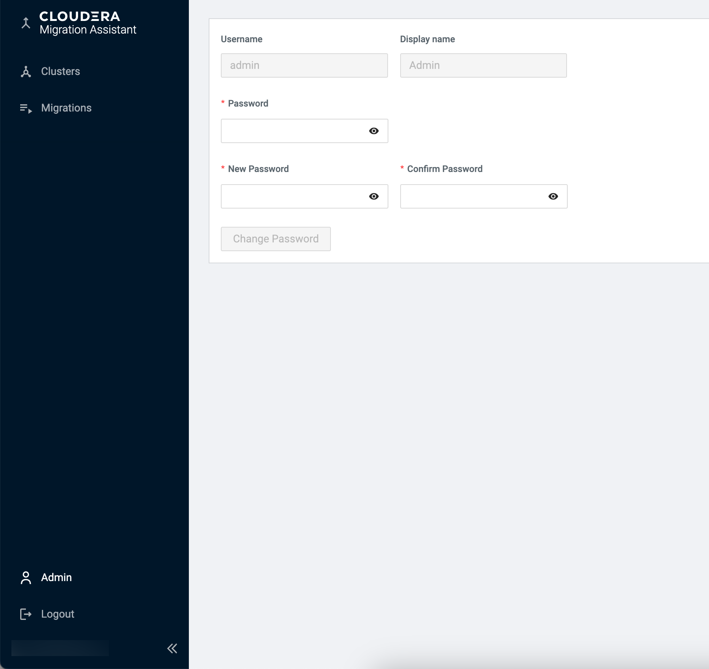

# Setting up CMA server

You can deploy CMA Server (cma-server) to any of your cluster nodes or preferably to an 
external node that has visibility both to the cluster and the Internet. It requires 1.5 GB 
of extra memory.

## Downloading CMA server

Download the latest CMA binaries from https://archive.cloudera.com/cma/3.2.0.0-21/.

The supported version of the CMA is 2.4.0.0 and higher.

```shell
wget https://archive.cloudera.com/cma/3.2.0.0/tars/cma-3.2.0.0-21-bin.tar.gz
```
or
```shell
curl https://archive.cloudera.com/cma/3.2.0.0/tars/cma-3.2.0.0-21-bin.tar.gz --output cma-3.2.0.0-21-bin.tar.gz
```

Extract the downloaded file.
```shell
tar xzf cma-3.2.0.0-21-bin.tar.gz
```
## Starting CMA server

After extracting the compressed file, there are two ways to start the CMA server:
[in docker container](#starting-cma-server-in-docker-container) or [locally](#starting-cma-server-locally)

### Starting CMA server in Docker Container

Ensure that docker 20+ is installed on the host. For more information, see [installing docker engine](https://docs.docker.com/engine/install/) documentation.

Run the _cma-docker.sh_ script in the untarred top-level folder to launch the CMA server in a docker container.
```shell
cma-3.2.0.0-21/bin/cma-docker.sh --start
```

> **_NOTE:_** The script will automatically create the docker image if necessary. 
> Additionally, the script provides the following operations to manage the CMA docker container: 
> **start**,**stop**,**restart**,**rebuild**. If you want to know what other options are available, please see the help.
> ```cma-3.2.0.0-21/bin/cma-docker.sh --help```

### Starting CMA server locally

The preferred way of running CMA server is using docker,
however if you have constraints on docker you can install it directly on any host. 

Ensure that Python 3.8.12 or later is installed on the host.

Run the _cma-local.sh_ script in the untarred top-level folder and follow its instructions to launch the CMA server locally.
```shell
cma-3.2.0.0-21/bin/cma-local.sh --start
```
> **_NOTE:_** The script will create a python virtual environment in the top-level folder where the dependencies will be installed.
> Additionally, the script provides the following operations to manage the CMA locally:
> **start**,**stop**,**restart**,**rebuild**. If you want to know what other options are available, please see the help.
> ```cma-3.2.0.0-21/bin/cma-local.sh --help```

After around half a minute CMA server (aka control node) is reachable at _http://localhost:8090_ in a browser like Chrome
or Firefox.



The default user password pair is admin-admin, but you can change your password at the user porfile page.



You  also need to make sure you that CMA host has a line of sight to the cluster nodes, by configuring _/etc/hosts_ or _/etc/resolv.conf_ files.