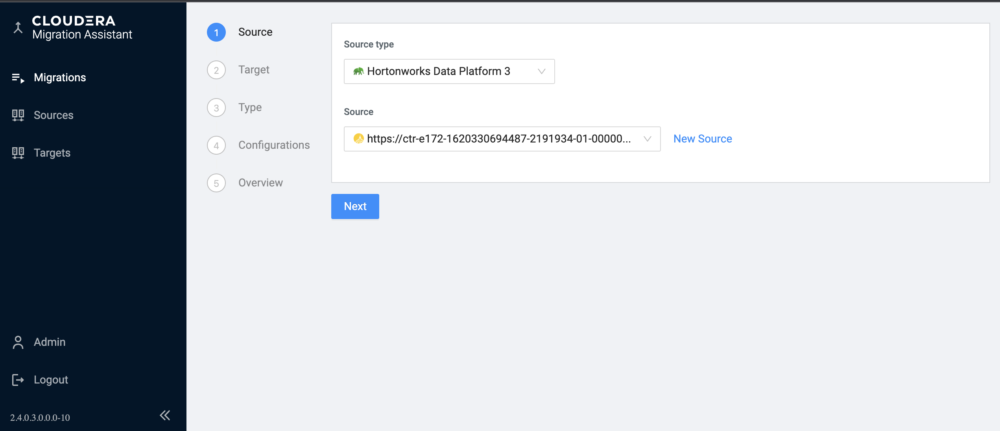
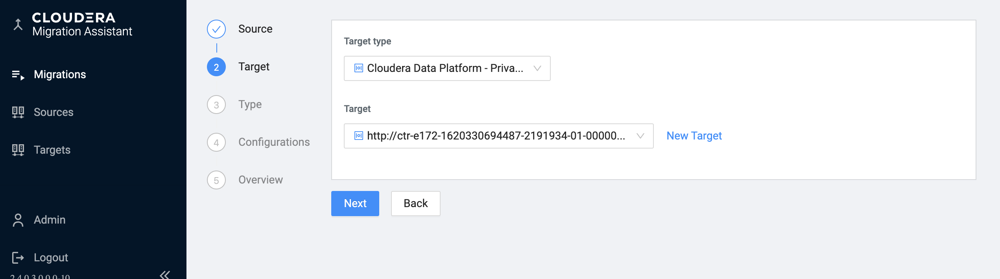
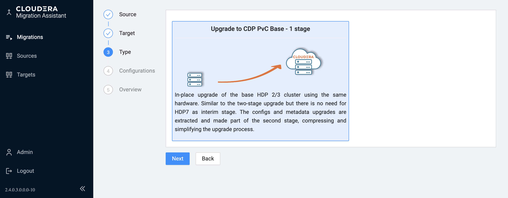
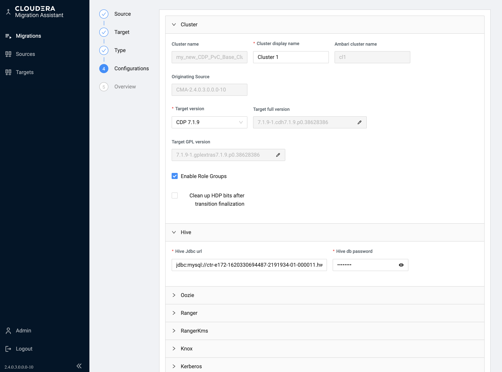
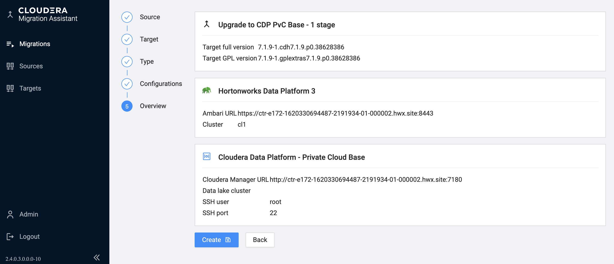
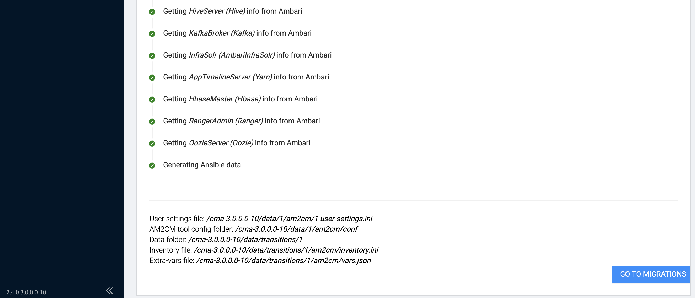
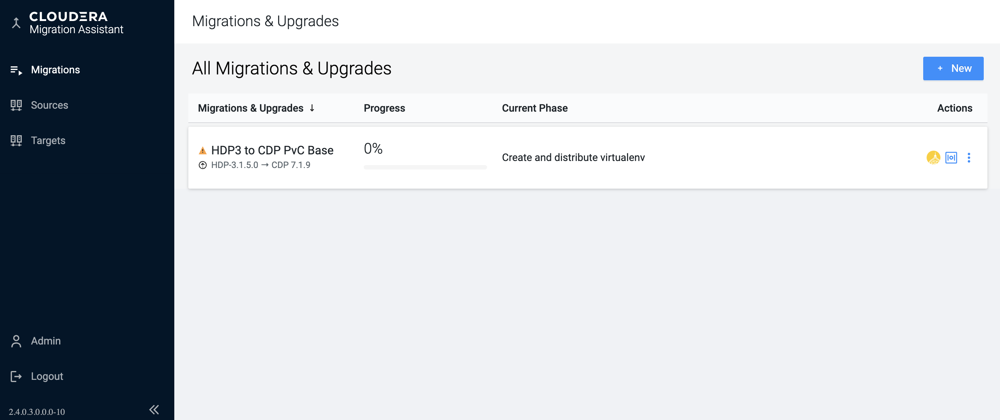

## HDP to CDP Private CLoud Base Upgade

You need to add your previously registered source :

... and target:

Configure the CDP Private Cloud Base Runtime parcel and credentials.
Currently there is only one migration type to choose from :

You can either select CDP Private Cloud Base Runtime parcel from the major released versions or you can also edit the full target version specifying exact hotfix version numbers.  Be aware that the CM version you manually installed need to match the CDP Runtime version you choose here.

As CMA can not access the service specific passwords on the HDP cluster,  you need to provide them here. You may collect it in advance.
Unlike with classic two-stage upgrade, when your source cluster has __Accumulo__ service
installed you can choose to migrate your data to CDP PvC Accumulo. Accumulo is not part of the 
CDP run-time parcel so you need to install ACCUMULO_ON_CDP parcel and keep _Deploy Accumulo_ switch 
as true, as shown on the screenshot below. 

See [Suported Platforms Page](supported-platforms.md) page
to check the platform pairs where the Accumulo upgrade is supported.

Click __Next__ todouble check the target version you chose.

 and then click __Create__ to complete the registration.

If it is all done successfully you will see your newly registered migration in the __Migration__ menu :

> Note\
> The transition data is stored in _<$AM2CM_ROOT>/data/transtions/<Transition ID>_ directory. The following files are important for future references:
> * \*_<TID>-var.json_: Parameters collected during the registration process. This is an external VARS file passed to the ansible scripts.
> * \*_<TID>-inventory.ini_: The hosts and their roles mapped to an ansible inventory file
