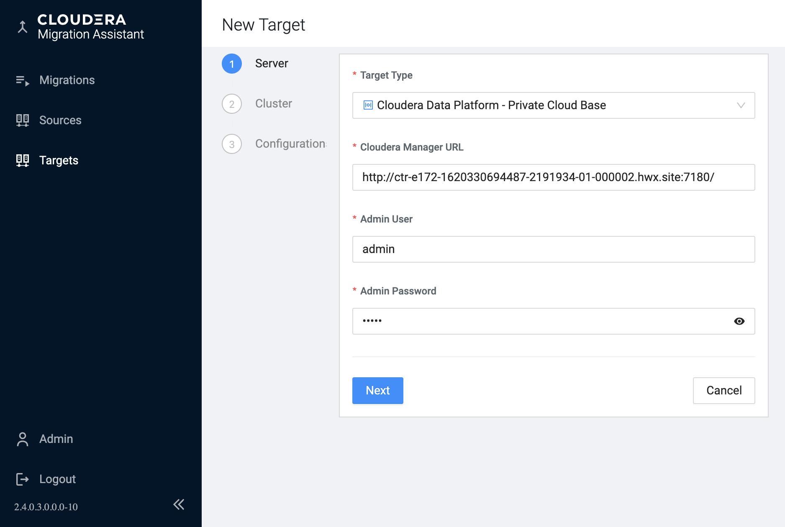
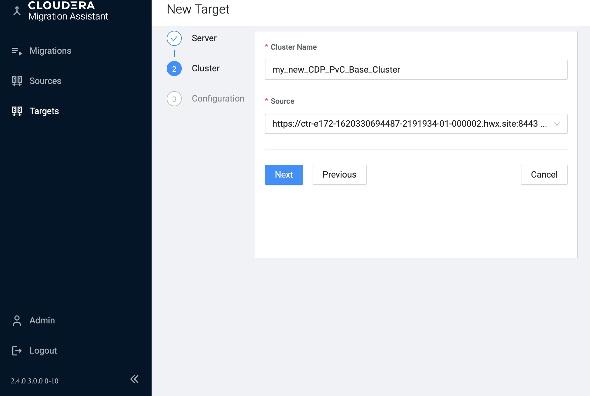
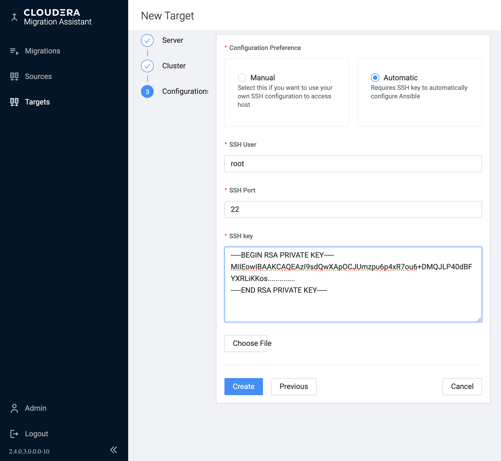
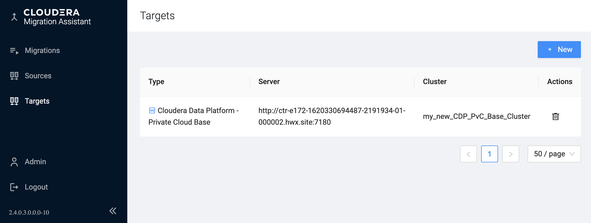

# CDP Private Cloud Base

If you want to upgrade an HDP cluster to Cloudera Data Platform Private Cloud Base you must reregister the same source cluster as a target.

The official [Cloudera HDP One-stage Upgrade documentation](https://docs.cloudera.com/cdp-private-cloud-upgrade/latest/upgrade-hdp3-one-stage/topics/amb3-one-stage-upgrade-and-migrate-overview.html) is a good starting point. It does not only details the HDP upgrade prequisites but describes how to [install a new Cloudera Manager](https://docs.cloudera.com/cdp-private-cloud-upgrade/latest/upgrade-hdp3-one-stage/topics/amb3-one-stage-cm-installation-setup.html) with Cloudera Management Service running, which is needed at this point and currently not automated for HDP.

Then you can give a name to your new CDP cluster, that will be created by CMA in CM during the uppgrade (migration) execution.

For an HDP to CDP PvC Upgrade the target has the same access credentials as in when given at the source cluster : 

Finally you see our registered target in the __Targets__ menu.

