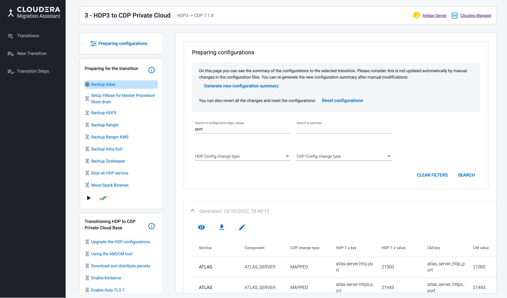
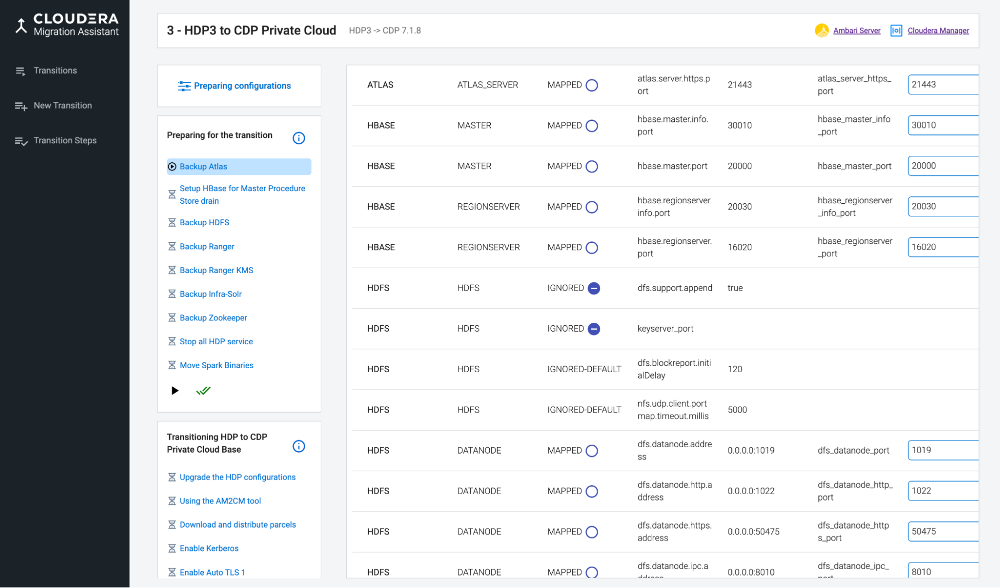

# Preparing configurations

This section helps you in understanding how the Ambari parameters are mapped to the new cluster on Cloudera Manager, analyze the differences, and update the mappings accordingly.

* In the Preparing Configurations page, you can review and compare the configuration key-value pairs in the current cluster versus the new CDP Private Cloud Base cluster.

  

* You can edit the mapping rules and generate a new configuration summary with changes. You can try multiple settings before mapping the HDP parameters to CDP. You can export the configurations to a CSV file, share with others, and reset the mapping rules to default and start again.
* The __Export configuration files__ option helps you to download a zip file of the migration ruleset. You can also import an old ruleset with the Import configuration files function.
* If the default mapping behavior is not accepted, you can edit the mapping using the icon. __CDP Change Type__ describes how the HDP configuration parameters are mapped to the CDP Private Cloud Base configuration parameters. For example,
  * __ADDITIONAL-PARAM__: Newly introduced parameter in the CDP Private Cloud Base cluster. This parameter does not have an HDP equivalent parameter.
  * __IGNORED__: This parameter is not mapped to CDP Private Cloud Base cluster.
  * __IGNORED-DEFAULT__: CMA considers the default value on HDP cluster and sets the default CDP value on the CDP cluster. For example, the default port value is 7085 for ranger.service.shutdown.port. Accordingly, the default port value is updated on the CDP cluster.
  * __MAPPED__: HDP key/value pair are mapped to a different CDP key/value pair
  * __NO-SAFETY-VALVE-IGNORED__: Configurations without defined mapping or safety valves are ignored.
  * __SAFETY-VALVE(safety_valve_type)__: This HDP configuration is migrated to the CDP safety valve configuration. For more information, see Cloudera Manager Custom Configuration.
    
  * 
  
* The radio buttons help you to add or remove a configuration from the IGNORED list. If you change the configuration, the row color changes to highlight the changed configurations. You can also add new configurations to the mapping.
* You can add a new additional parameter or a parameter to a safety valve by selecting the CDP change type.
* After completing the review and editing all the parameters, click Finalize Configurations Changes to generate a new configuration summary with the new ruleset. This process can be performed multiple times and the am2cm tool will use the last version of the ruleset.