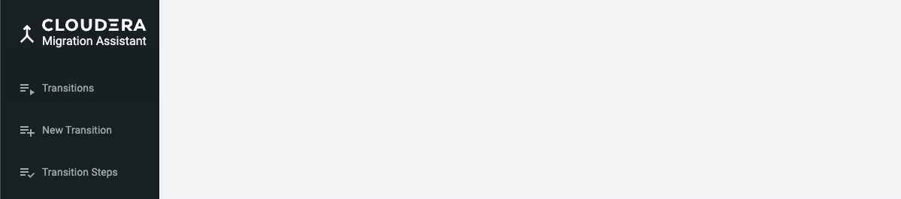
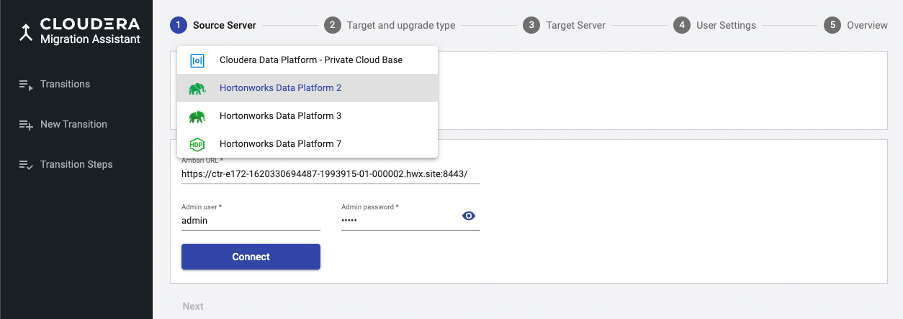
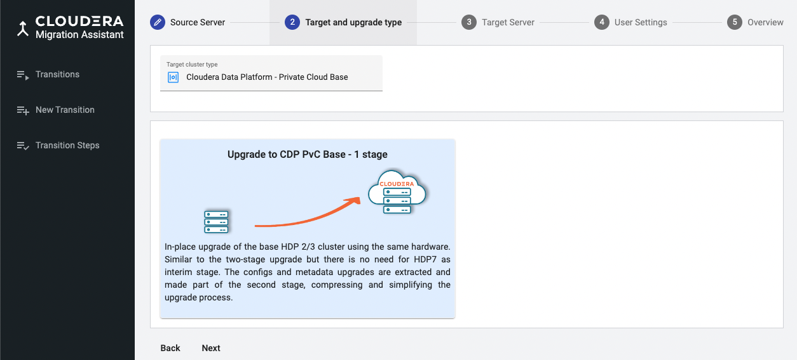
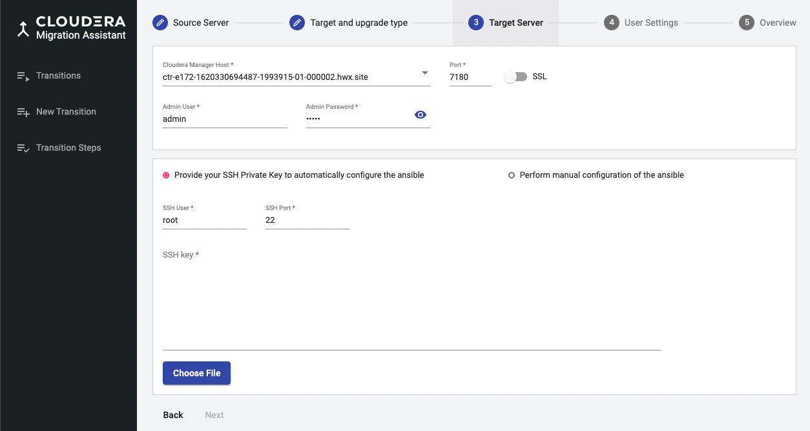
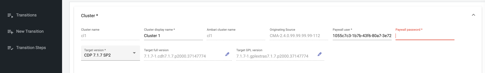
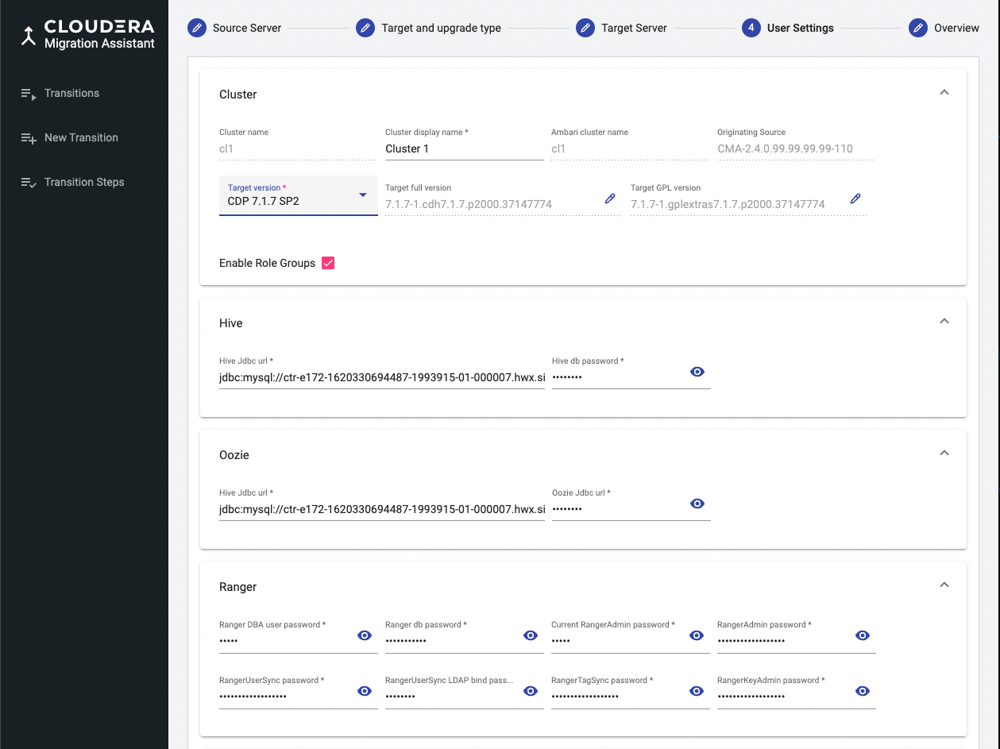
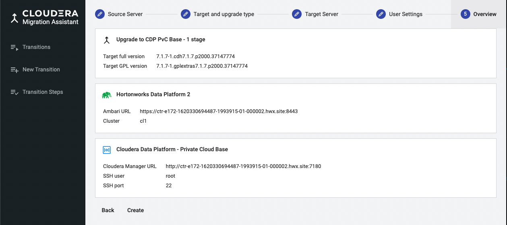
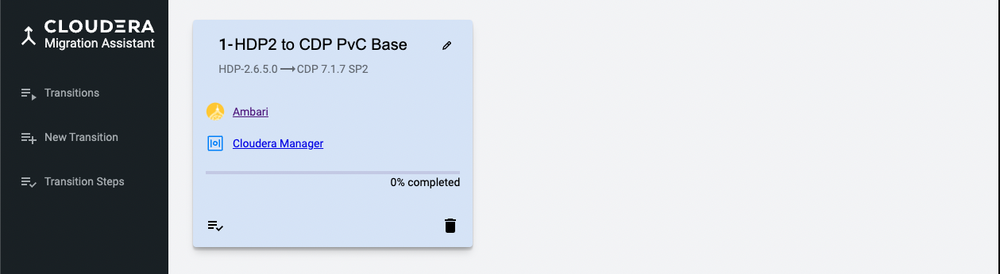

# Registering Ambari

In order to upgrade your HDP cluster you needs to register it as source cluster
In this chapter we create a new  **transition** by registering our source HDP cluster 
and specifying our planned target cluster type and version. 
In general a transition represents a path from a specific base cluster instance 
to a target a cluster, however our current transition is an in-place upgrade. 

It is possible to manage several transitions with a single CMA Server instance. 

The process starts with a __registration__ wizard, gathering all the cluster data into the __data__ directory, 
and then continues with the __execution__ phase where the collected data is used by Ansible scripts carrying out
the required upgrade steps. 

## Registration Steps

### 1. 
On the left navigation pane, click __New Transition__.

  

### 2.

Select  your cluster type and enter your Ambari URL, admin user and admin password. 
By clicking __Connect__,
you will be able to choose the cluster name you want to upgrade. 

The see the complete set of supported source and target platforms versions see 
[Suported Platforms Page](supported-platforms.md)

Click __Next__

### 3.

On the following page you can specify your target cluster type which is in 
this case can only be CDP Private Clouder Base, and the transition type. 
CMA currently support only one-stage upgrade from HDP. 

### 4.

As a result a page for registering Cloudera Manager and private keys to the nodes is displayed.

   

> Note\
> CM URL is not cross-checked at this stage but the execution phase will 
> fail without having an installed empty Cloudera Manager running. 

### 4.

Configure the CDP Private Cloud Base Runtime parcel and credentials.

You can either select CDP Private Cloud Base Runtime parcel from the major 
released versions or you can also edit the full target version specifying exact 
hotfix numbers.  Be aware that the CM version you manually installed need to match the CDP Runtime version
you choose here. 

As CMA can not access the service specific passwords  on the HDP cluster,  you need to
provide them here. You may collect it in advance. 

   

Unlike with classic two-stage upgrade, when your source cluster has __Accumulo__ service
installed you can choose to migrate your data to CDP PvC Accumulo. Accumulo is not part of the 
CDP run-time parcel so you need to install ACCUMULO_ON_CDP parcel and keep _Deploy Accumulo_ switch 
as true, as shown on the screenshot below. 

See [Suported Platforms Page](supported-platforms.md) page
to check the platform pairs where the Accumulo upgrade is supported.
 

### 5. 

Click __Next__, double check the target version you chose and then click __Finish__ to complete the registration.

> Note\
> The transition data is stored in _<AM2CM_ROOT>/data/<Transition ID>_ directory. The following files are important for future references:
> * \*_<TID>-var.json_: Parameters collected during the registration process. This is an external VARS file passed to the ansible scripts.
> * \*_<TID>-inventory.ini_: The hosts and their roles mapped to an ansible inventory file

After the registration is successful, a new light blue tile is added under the Transitions menu.

